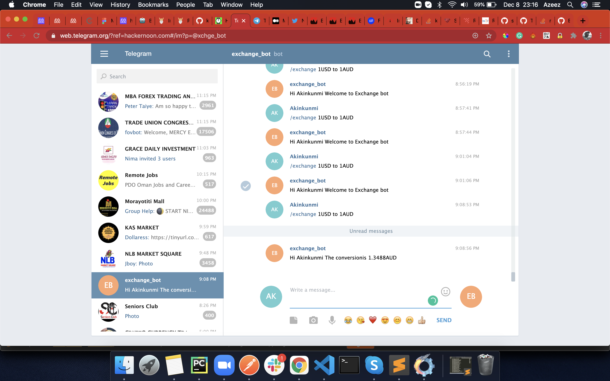
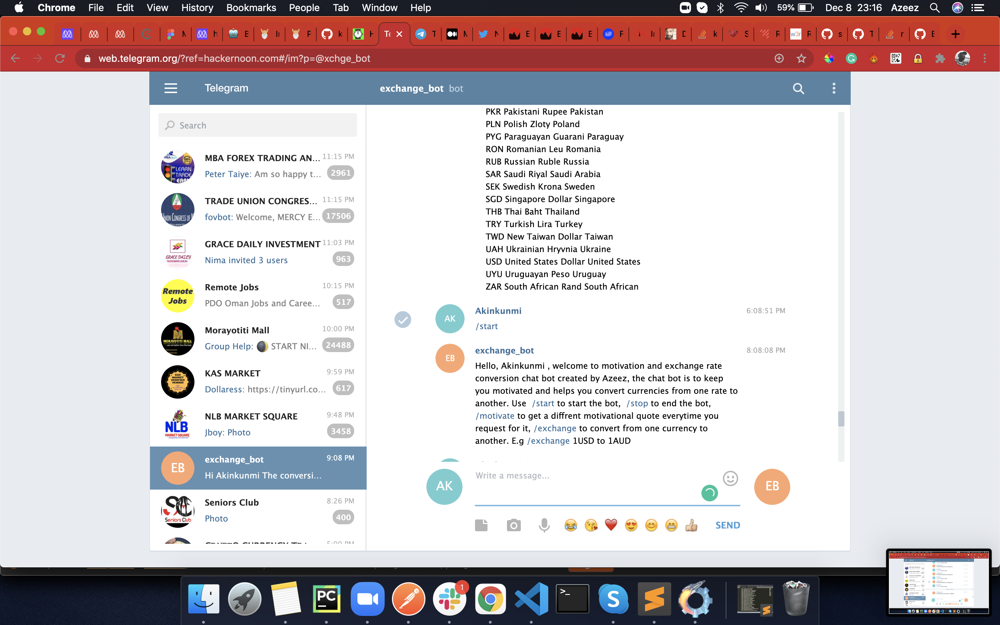

# exchange-bot
A twitter bot that helps with currency conversion once mentioned in a tweet

> A twitter bot that helps with currency conversion once mentioned in a tweet

## Description

if you feel down and needs to get motivated. Exchange bot can help with some motivational quotes. If you also needs to get currency conversion exchange rates.

## How to install

1. Run `git clone https://github.com/kunmi02/exchange-bot` on your terminal.
2. Make sure you have Ruby and Bundle installed.
3. Open terminal from the root directory of the cloned project.
4. Run `bundle install` to install all packages.
5. Go to web.telegram.com
6. Create an account with your mobile number
7. Create a new bot by chatting up botfather, then follow the instructions.
8. A token will be generated for your bot which you need to copy and keep safe
9. search for the name of your bot.
12. Click on the bot and send `/start` to get instructions on how to run the bot 

## Built With

- Ruby
- Ruby Telegram Bot
- RSpec
- Linter
- VScode

## Contributing

Contributions, issues and feature requests are welcome! Start by:

  - Forking the project
  - Cloning the project to your local machine
  - cd into the project directory
  - Run git checkout -b your-branch-name
  - Make your contributions
  - Push your branch up to your forked repository
  - Open a Pull Request with a detailed description to the development branch of the original project for a review

## Author

👤 Azeez Ibrahim
- Github: [@@kunmi02](https://github.com/kunmi02)
- Twitter: [@akinkunmi006](https://twitter.com/akinkunmi006)
- LinkedIn: [Azeez Ibrahim](https://www.linkedin.com/in/akinkunmi006/)

## Show your Support
Give a ⭐ if you like this project!

